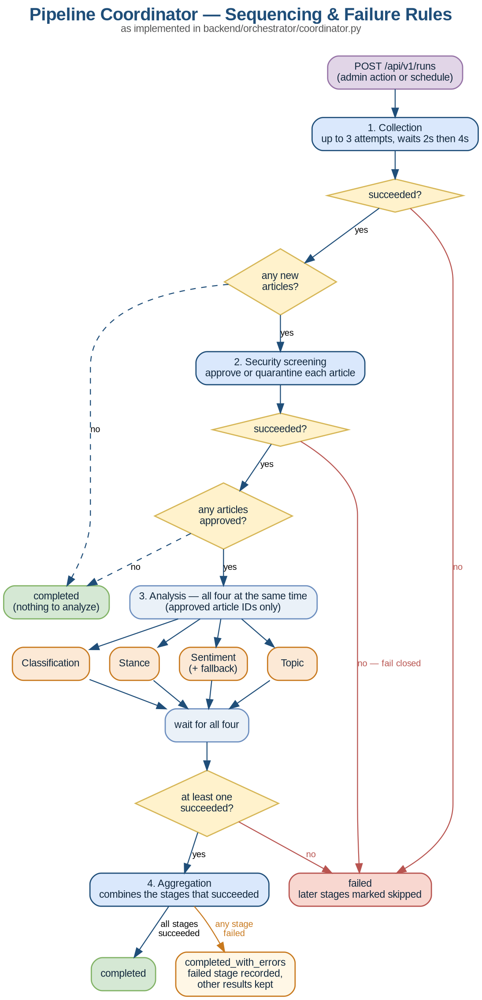

# Pipeline Coordinator (SS-4)

**Status: groundwork in place, run store connected and verified.** The
sequencing and failure handling are built and tested (20 tests). Every
agent is still a stub. Run status goes to the Supabase `pipeline_runs` /
`pipeline_stage_runs` tables when credentials are set, and a full
seven-stage run has been recorded end to end. See
[Supabase run store](#supabase-run-store).

## What it does

The coordinator runs the agents in a fixed order and records what
happened at each step:

**Collection → Security → Analysis (sentiment, topic, classification, stance, all at once) → Aggregation**

It moves *control*, not data. Agents read articles from the database and
write their own results back; the coordinator only tells each agent when
to start, passes along article IDs, and records whether each stage worked.



## Failure rules

| Stage | Attempts | If it still fails |
|---|---|---|
| Collection | 3 (waits 2s, then 4s) | Run **fails** — nothing to analyze. Later stages marked `skipped`. |
| Security | 2 | Run **fails** and analysis is skipped, so unscreened content is never analyzed. |
| Sentiment | 2, then fallback agent | Stage marked `failed`; the other analysis stages keep going. |
| Topic / Classification / Stance | 2 | Stage marked `failed`; the other analysis stages keep going. |
| Aggregation | 2 | Run is `completed_with_errors`; analysis results are kept. |

Each run ends in one of three states:

- `completed` — every stage that needed to run succeeded
- `completed_with_errors` — finished, but at least one stage failed (the rest of the results are kept)
- `failed` — stopped early, or no analysis stage succeeded

A run is never left stuck at `running`: if the coordinator itself hits an
error, the run is recorded as `failed` with the error in its notes.

Retry counts and wait times are starting values in `orchestrator/retry.py`.

## Code layout

```
backend/
  app.py                    Flask app; registers the /api/v1/runs endpoints
  run_pipeline.py           terminal demo — runs the pipeline once and prints a table
  orchestrator/
    stages.py               stage names, order, and status values
    models.py               run/stage records (match the proposed tables column for column)
    agents.py               the agent contract + stub agents
    registry.py             which agent runs each stage — edit this to plug in real agents
    retry.py                attempts and backoff per stage
    coordinator.py          sequencing and failure handling
    runner.py               runs the pipeline on a background thread
    routes.py               API endpoints
    store.py                the RunStore interface + the in-memory implementation
    supabase_store.py       Supabase implementation (verified against the real database)
  tests/                    20 tests (more get added as features land)
  .env                      SUPABASE_URL / SUPABASE_KEY — gitignored, never commit
docs/
  pipeline_tables.sql       the originally proposed SQL; see the note in its header
supabase/
  migrations/               schema changes applied with `supabase db push`
```

## Running it

From the `backend` folder:

```
pip install -r requirements-dev.txt

python run_pipeline.py                      # normal run
python run_pipeline.py --fail topic         # one analysis agent fails
python run_pipeline.py --fail sentiment     # sentiment fails, fallback takes over
python run_pipeline.py --fail security      # screening fails, analysis skipped
python run_pipeline.py --flaky collection   # fails once, succeeds on retry

python -m pytest tests                      # run the tests
```

Through the API (with `python app.py` running):

```
curl -X POST http://localhost:5000/api/v1/runs      # start a run -> 202 with the run ID
curl http://localhost:5000/api/v1/runs/1            # progress of run 1, stage by stage
curl http://localhost:5000/api/v1/runs              # recent runs, newest first
```

Starting a run while another is active returns `409` with the active run's ID.

## Testing plan

The 20 current tests cover this week's work: stage order, the four
analysis agents running at the same time, each failure rule, and the
API. Tests get added alongside the features they cover:

| When we... | Add tests for |
|---|---|
| switch to the Supabase tables | the Supabase store, and a check that the SQL and code stay in sync |
| plug in the real agents | malformed output, duplicate articles, quarantined articles, misbehaving agents |
| have the dashboard poll run status | the run-list and run-status endpoints |
| settle the retry settings | retry counts and backoff timing |
| add scheduled runs or single-stage re-runs | run lifecycle rules |

## For agent owners: plugging in your agent

1. Subclass `Agent` from `orchestrator/agents.py` and implement `run(ctx)`.
2. `ctx` holds `run_id`, `article_ids` (collected), `approved_ids`
   (passed security), and `completed_analysis` (for aggregation). It
   never holds article text — read what you need from the database.
3. Write your results to your own table, then return a small summary dict.
4. If something goes wrong, **raise an exception**. Don't retry inside
   your agent and don't swallow errors — the coordinator handles retries,
   fallbacks, and recording the failure.
5. Replace your stage's stub in `build_default_registry()` in `registry.py`.

What each stage must return (the coordinator checks this and treats
anything else as a failure):

| Stage | Return value |
|---|---|
| Collection | `{"article_ids": [...]}` — IDs of the articles stored this run |
| Security | `{"approved_ids": [...], "quarantined_ids": [...]}` — approved IDs must come from the collected ones |
| Sentiment / Topic / Classification / Stance | any dict, e.g. `{"processed": 42}` |
| Aggregation | any dict |

Example:

```python
from orchestrator.agents import Agent

class SentimentAgent(Agent):
    name = "sentiment"

    def run(self, ctx):
        # read articles ctx.approved_ids from the database,
        # classify them, write rows to sentiment_results
        return {"processed": len(ctx.approved_ids)}
```

```python
# registry.py
registry.register(SENTIMENT, SentimentAgent(), fallback=agents.stub_fallback(SENTIMENT))
```

## Supabase run store

`app.py` picks the store at startup (`build_run_store()`): Supabase when
`SUPABASE_URL` and `SUPABASE_KEY` are both set, in-memory otherwise. The
fallback keeps the app startable for front-end work without credentials;
in-memory runs are lost when the process stops.

### Setup

1. `pip install -r requirements.txt`
2. Create `backend/.env` from `.env.example` and fill in the key.
   It is gitignored — **never commit it.**

```
SUPABASE_URL=https://uivjesdostuaihbjpdjr.supabase.co
SUPABASE_KEY=sb_secret_...
```

Use the **secret** key. The publishable (`sb_publishable_…`) key has no
privileges on the run tables — writes fail with `42501 permission
denied`. Postgres suggests fixing that with `GRANT INSERT … TO anon`;
don't. The publishable key ships to browsers, so that would let anyone
forge pipeline runs.

`SUPABASE_URL` is the API endpoint, not the dashboard page. A dashboard
URL returns an HTML login page, which surfaces as a confusing
`TypeError: string indices must be integers`.

### Verified

Every `RunStore` method round-trips against the real database: create,
read, list, and update, for both runs and stages, with timestamps
parsing back to `datetime`, including the four analysis stages writing
concurrently.

**Any `RunStore` must be thread-safe.** The coordinator runs the four
analysis stages in a `ThreadPoolExecutor`, so all four update their rows
at the same time. `SupabaseRunStore` holds one HTTP connection, which
cannot be shared across threads, so every method takes a lock; without
it the parallel stages all fail with `ReadError: [WinError 10035]` while
collection and security pass, because those run sequentially. The writes
are short, so serialising them costs nothing next to the agents' work.

### The deployed schema differs from `pipeline_tables.sql`

The tables were created from the *original* proposal, before the team
agreed the changes listed at the top of that file. What is deployed:

| | `pipeline_tables.sql` says | deployed table enforces |
|---|---|---|
| `stage_name` | includes `security`, final stage `aggregation` | **fixed** — see below |
| `attempt` | `default 0` | `default 1`, `check (attempt >= 1)` |
| unique key | `(run_id, stage_name)` | `(run_id, stage_name, attempt)` |
| `articles_collected` | nullable, no default | `default 0` |
| `pipeline_runs` | — | extra `one_running_pipeline` constraint |

The `stage_name` check originally rejected `security` and `aggregation`,
which killed every run at the security stage.
`supabase/migrations/20260924000153_align_stage_name_constraint.sql`
fixes it and **has been applied**.

`create_stage` works with either `attempt` default, since it omits the
column and lets the database decide.

### The migration history is out of sync

That migration was applied through the dashboard SQL editor, not
`supabase db push`, because push refuses:

> Remote migration versions not found in local migrations directory.

The remote database records twelve migrations that have no files in this
repo — they were applied from elsewhere. **Do not run the
`supabase migration repair --status reverted ...` command the CLI
suggests.** It does not undo anything; it deletes those rows from the
remote history, so a teammate whose repo *does* hold those twelve files
would have `db push` try to re-run all of them against the live
database.

The fix is `supabase db pull` (needs Docker running), which captures the
real remote schema locally and gets the two histories agreeing. Until
someone does that, no repo describes the deployed schema — which is how
`security` and `aggregation` stayed missing for as long as they did.
The migration file is idempotent, so re-applying it after a pull is
harmless.

Two smaller mismatches are left open for the team:

- **`attempt` semantics.** A pending stage reads `attempt=0` from the
  in-memory store and `attempt=1` from Supabase. Harmless once a stage
  runs — the coordinator overwrites it — but the two stores are not
  identical for `pending` and `skipped` stages.
- **`articles_collected` defaults to 0**, so "collected nothing" and
  "not known yet" cannot be told apart.

Tests for the Supabase store are still to be written, including one that
fails if the deployed schema and the code drift apart.

## Known limitations and next steps

- **No per-stage timeout.** An agent that hangs holds up its run.
- **Runs live inside the Flask process.** If the server stops mid-run,
  that run stays at `running`. A startup check that marks stale runs as
  `failed` would fix this. With Supabase this also blocks the next run,
  because of the `one_running_pipeline` constraint below.
- **Concurrent runs fail with the wrong error.** `BackgroundRunner`
  guards with an in-process lock, which only covers one Flask process.
  The database's `one_running_pipeline` constraint is the real
  cross-process guard, but a second process hits it as a raw `APIError`
  from the insert rather than `RunAlreadyActive`, so the API returns 500
  where it should return 409.
- **No single-stage re-run yet.** Re-running just one stage needs to know
  which articles belonged to the run — see open question 3.
- **No auth on `POST /api/v1/runs`.** Should be admin-only once login (SS-5) exists.
- **Nothing schedules runs yet.** The `scheduled` trigger type is ready,
  but no scheduler calls it.
- **The dashboard doesn't poll run status yet.** The endpoint it needs exists.

## Open questions for the team

1. **Who writes results?** This assumes each agent writes its own result
   rows. If we'd rather agents return results for the coordinator to
   write, only the agent contract changes — not the sequencing.
2. **When does screening happen?** This assumes collection stores articles
   and returns their IDs, and security then approves or quarantines them.
   If nothing should be stored before screening, collection would hand
   over unsaved articles instead — a small change to the collection and
   security contracts.
3. **Add `run_id` to the four results tables?** It would let us filter
   results by run and clean up a failed run's partial output. Commented
   out at the bottom of `pipeline_tables.sql`.
4. **Stage names — resolved.** The SQL adds `security` and `stance` to
   the original proposal and names the last stage `aggregation` rather
   than `aggregate`. The deployed table had never been updated to match;
   the migration in `supabase/migrations/` has now been applied and runs
   record all seven stages. See
   [Supabase run store](#supabase-run-store).
