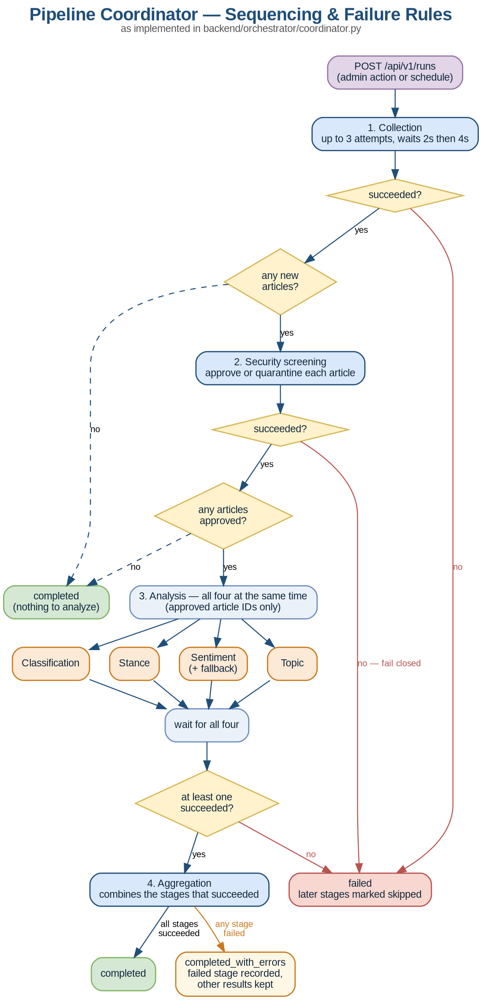

# Pipeline Coordinator (SS-4)

**Status: running end to end with three real agents.** The sequencing
and failure handling are built and tested (73 tests). Collection,
security and classification are the team's real agents; sentiment,
topic, stance and aggregation are still stubs — see
[Which agents are real](#which-agents-are-real). Run status goes to the
Supabase `pipeline_runs` / `pipeline_stage_runs` tables when credentials
are set, and a full seven-stage run over 40 real articles has been
recorded end to end. See [Supabase run store](#supabase-run-store).

## What it does

The coordinator runs the agents in a fixed order and records what
happened at each step:

**Collection → Security → Analysis (sentiment, topic, classification, stance, all at once) → Aggregation**

It moves *control*, not data. Agents read articles from the database and
write their own results back; the coordinator only tells each agent when
to start, passes along article IDs, and records whether each stage worked.



## Failure rules

| Stage | Attempts | If it still fails |
|---|---|---|
| Collection | 3 (waits 2s, then 4s) | Run **fails** — nothing to analyze. Later stages marked `skipped`. |
| Security | 2 | Run **fails** and analysis is skipped, so unscreened content is never analyzed. |
| Sentiment | 2, then fallback agent | Stage marked `failed`; the other analysis stages keep going. |
| Topic / Classification / Stance | 2 | Stage marked `failed`; the other analysis stages keep going. |
| Aggregation | 2 | Run is `completed_with_errors`; analysis results are kept. |

Each run ends in one of three states:

- `completed` — every stage that needed to run succeeded
- `completed_with_errors` — finished, but at least one stage failed (the rest of the results are kept)
- `failed` — stopped early, or no analysis stage succeeded

A run is never left stuck at `running`: if the coordinator itself hits an
error, the run is recorded as `failed` with the error in its notes.

Retry counts and wait times are starting values in `orchestrator/retry.py`.

## Code layout

```
backend/
  app.py                    Flask app; registers the /api/v1/runs endpoints
  run_pipeline.py           terminal demo — runs the pipeline once and prints a table
  orchestrator/
    stages.py               stage names, order, and status values
    models.py               run/stage records (match the proposed tables column for column)
    agents.py               the agent contract + stub agents
    registry.py             which agent runs each stage — real agents or stubs
    retry.py                attempts and backoff per stage
    coordinator.py          sequencing and failure handling
    runner.py               runs the pipeline on a background thread
    routes.py               API endpoints
    store.py                the RunStore interface + the in-memory implementation
    supabase_store.py       Supabase implementation (verified against the real database)
  agents/                   the team's agent implementations, one package per owner
    supabase_client.py      the one Supabase client the agents share
    adapters.py             the Agent subclasses the coordinator calls
    collection/             fetch, dedupe, relevance filter, preprocess
    security/               sanitization filter + its adversarial suite
    classification/         stakeholder and source-type classifiers
    topic/                  BERTopic model — standalone, stage still stubbed
  tests/                    73 tests (more get added as features land)
  .env                      credentials — gitignored, never commit
docs/
  pipeline_tables.sql       the originally proposed SQL; see the note in its header
supabase/
  migrations/               schema changes applied with `supabase db push`
pyrightconfig.json          type-checker settings
```

The split matters: `orchestrator/` never imports an agent, and
`agents/<stage>/` is its owner's code. `agents/adapters.py` is the only
file that knows about both, so an owner can keep working in their own
package without touching sequencing code.

## Which agents are real

| Stage | Agent | Notes |
|---|---|---|
| Collection | **real** | `agents/collection/` — NewsAPI, GNews and six RSS feeds, then dedupe, relevance filter and body extraction |
| Security | **real** | `agents/security/` — sanitization filter; see the gap below |
| Classification | **real** | `agents/classification/` — LLM classifier when `TRUSSED_API_KEY` is set, keyword scorer otherwise or as its fallback |
| Sentiment | stub | no implementation on any branch yet |
| Stance | stub | no implementation on any branch yet |
| Topic | stub | `agents/topic/topic_model.py` works standalone — see below |
| Aggregation | stub | not written yet |

`build_default_registry(live=...)` chooses. `live=None` (the default)
decides from the environment: real agents when Supabase is configured,
stubs otherwise, so the demo and the tests work on a machine with no
`.env`. The stubbed stages stay stubbed whatever it is asked.

### Collection

Fetch → store → relevance filter → preprocess, then report the IDs.

It returns only the articles it stored **that analysis can actually
use**: marked relevant and preprocessed successfully. An article whose
page could not be downloaded has no `clean_content`, and every analysis
agent reads `clean_content`, so passing its ID on would just produce
four failures further down.

A run where every article was already stored collects nothing and
finishes early with "No new articles were collected". That is correct,
not a fault — but it means you cannot exercise the rest of the pipeline
that way once the corpus is current. `--backlog` (below) exists for
that.

### Security

Screens each collected article's title and body through
`agents/security/text_filter.py`. Anything the filter rejects is left
out of `approved_ids`, so no analysis agent is handed it.

**The filter scores 29/45 against its own adversarial suite**
(`python -m agents.security.adversarial_test_set` from `backend/`): 14
false negatives, 2 false positives. The misses are mostly obfuscated
prompt injection — zero-width splitting, homoglyphs, leetspeak,
separator splitting, fullwidth characters, base64 payloads — which the
suite's own docstring describes a normalization layer for that was
never written. It is wired in as-is by decision; closing the gap is the
security owner's.

One change was necessary to wire it in at all. The filter's
`MAX_COMMENT_LENGTH` is 5000 characters, which suits the user comments
it was first written for. **68% of the articles in the corpus are
longer than that**, and screening 60 of them with the default
quarantines 45 for length alone. `SecurityAgent` raises the cap to
200,000 for article bodies (the longest article today is 101,377
characters) and leaves the filter's own default untouched for other
callers.

Two things it deliberately does not do:

- **Quarantine decisions are not persisted.** There is no table for
  them. They are logged at WARNING and counted by reason in the stage's
  summary, so you can see what a run rejected and why, but you cannot
  query it afterwards. Adding a table is a schema change for the team.
- **The redacted text is not written back.** The filter redacts emails,
  phone numbers, SSNs and addresses in the text it returns, but analysis
  agents read `clean_content` straight from the database and so still
  see the unredacted article. Screening currently decides pass or
  quarantine, nothing more.

### Classification

Writes `stakeholder_category` and `source_type` to
`classification_results` for the approved articles, tagged with which
classifier produced the row so the two can be compared (classification
README, F.10).

The LLM classifier runs as the primary agent with the keyword scorer as
its fallback **only when `TRUSSED_API_KEY` and `TRUSSED_BASE_URL` hold
real values**. A placeholder copied from `.env.example` counts as
unset — otherwise every run burns its retries on a 401 before falling
back.

### Topic — why it is still a stub

`agents/topic/topic_model.py` works and has already written 243 rows to
`topic_results`. It is not wired in because it needs `bertopic`,
`sentence-transformers`, `umap-learn` and `torch`: roughly 2GB, which
would land on everyone who installs the backend and on CI. Run it by
hand for now:

```
pip install bertopic sentence-transformers umap-learn pandas scikit-learn
python -m agents.topic.topic_model
```

Wiring it in means adding a `TopicAgent` to `agents/adapters.py` that
imports BERTopic inside `run()`, registering it in `registry.py`, and
dropping the `backend/agents/topic` entry from `pyrightconfig.json`.

## Running it

From the `backend` folder:

```
pip install -r requirements-dev.txt

python run_pipeline.py                      # normal run (stub agents, no database)
python run_pipeline.py --fail topic         # one analysis agent fails
python run_pipeline.py --fail sentiment     # sentiment fails, fallback takes over
python run_pipeline.py --fail security      # screening fails, analysis skipped
python run_pipeline.py --flaky collection   # fails once, succeeds on retry

python run_pipeline.py --live               # the real agents: fetches news, downloads
                                            # article pages, writes results
python run_pipeline.py --live --backlog     # the real agents over articles already
                                            # stored — no API quota, no downloads

python -m pytest tests                      # run the tests
python -m pyright backend/                  # type check (from the repo root)
```

`--backlog` is how to exercise the pipeline against the real corpus.
Plain `--live` fetches from the news APIs and downloads every new
article's page at one second apiece, and once the corpus is current it
usually collects nothing and the run finishes early.

`run_pipeline.py` always keeps run status in memory, never in
`pipeline_runs`, so a demo run does not show up in the dashboard's
history.

Through the API (with `python app.py` running):

```
curl -X POST http://localhost:5000/api/v1/runs      # start a run -> 202 with the run ID
curl http://localhost:5000/api/v1/runs/1            # progress of run 1, stage by stage
curl http://localhost:5000/api/v1/runs              # recent runs, newest first
```

Starting a run while another is active returns `409` with the active run's ID.

## Testing plan

73 tests, none of which touch the network: stage order, the four
analysis agents running at the same time, each failure rule, the API,
the Supabase store against a fake client, and the adapters against fake
agent modules. The suite passes `live=False`, so it behaves the same
with or without credentials in `backend/.env`.

Tests get added alongside the features they cover:

| When we... | Add tests for | |
|---|---|---|
| switch to the Supabase tables | the Supabase store, and a check that the SQL and code stay in sync | **landed** |
| plug in the real agents | malformed output, duplicate articles, quarantined articles, misbehaving agents | **landed** |
| have the dashboard poll run status | the run-list and run-status endpoints | waiting |
| settle the retry settings | retry counts and backoff timing | waiting |
| add scheduled runs or single-stage re-runs | run lifecycle rules | waiting |

The three groups still waiting are in `tests-to-add-later/`.

## For agent owners: plugging in your agent

1. Put your code in `backend/agents/<your stage>/`. It stays yours —
   nothing in `orchestrator/` imports it.
2. Add an `Agent` subclass to `agents/adapters.py` that calls your code
   and implements `run(ctx)`.
3. `ctx` holds `run_id`, `article_ids` (collected), `approved_ids`
   (passed security), and `completed_analysis` (for aggregation). It
   never holds article text — read what you need from the database.
4. Read and write the database through `agents/supabase_client.py`'s
   `get_client()`. Don't build your own client and don't call
   `load_dotenv()` at import time: your module gets imported by the
   test suite and by the app, not just run as a script.
5. Write your results to your own table, then return a small summary dict.
6. If something goes wrong, **raise an exception**. Don't retry inside
   your agent and don't swallow errors — the coordinator handles retries,
   fallbacks, and recording the failure. This is the rule the standalone
   scripts break most often: catching an error and printing it makes a
   failed stage look like a stage that found nothing.
7. Register it in `build_default_registry()` in `registry.py`, in the
   `live` branch.
8. Keep your work inside the IDs you were given. `ctx.approved_ids` is
   what security passed; a stage that processes the whole table instead
   is not doing the run it was asked for.

What each stage must return (the coordinator checks this and treats
anything else as a failure):

| Stage | Return value |
|---|---|
| Collection | `{"article_ids": [...]}` — IDs of the articles stored this run |
| Security | `{"approved_ids": [...], "quarantined_ids": [...]}` — approved IDs must come from the collected ones |
| Sentiment / Topic / Classification / Stance | any dict, e.g. `{"processed": 42}` |
| Aggregation | any dict |

Example:

```python
from orchestrator.agents import Agent

class SentimentAgent(Agent):
    name = "sentiment"

    def run(self, ctx):
        # read articles ctx.approved_ids from the database,
        # classify them, write rows to sentiment_results
        return {"processed": len(ctx.approved_ids)}
```

```python
# registry.py
registry.register(SENTIMENT, SentimentAgent(), fallback=agents.stub_fallback(SENTIMENT))
```

## Supabase run store

`app.py` picks the store at startup (`build_run_store()`): Supabase when
`SUPABASE_URL` and `SUPABASE_KEY` are both set, in-memory otherwise. The
fallback keeps the app startable for front-end work without credentials;
in-memory runs are lost when the process stops.

### Setup

1. `pip install -r requirements.txt`
2. Create `backend/.env` from `.env.example` and fill in the key.
   It is gitignored — **never commit it.**

```
SUPABASE_URL=https://uivjesdostuaihbjpdjr.supabase.co
SUPABASE_KEY=sb_secret_...
```

Use the **secret** key. The publishable (`sb_publishable_…`) key has no
privileges on the run tables — writes fail with `42501 permission
denied`. Postgres suggests fixing that with `GRANT INSERT … TO anon`;
don't. The publishable key ships to browsers, so that would let anyone
forge pipeline runs — or, for `articles`, inject content straight into
the corpus the analysis agents read.

### Which key unlocks what

Measured against the live project with a publishable key:

| | publishable key | secret key |
|---|---|---|
| Read `articles` | yes | yes |
| **Insert `articles`** (collection) | **no — 42501** | yes |
| Write `classification_results` | yes | yes |
| Write `pipeline_runs` / `pipeline_stage_runs` | **no — 42501** | yes |

So with a publishable key the pipeline runs, but only in `--backlog`
mode, and nothing about the run is recorded: `build_run_store()` falls
back to `InMemoryRunStore` and the history is lost when the process
stops. Collection fails all three attempts and the run ends `failed`
with the Postgres hint in `error_detail`.

### Two things that look like bugs and are not

- **`SUPABASE_URL` set to the dashboard page.** Copying the project URL
  out of the browser gives
  `https://supabase.com/dashboard/project/<ref>`, which serves an HTML
  login page. `agents/supabase_client.py` rejects it at startup with a
  message naming the problem; the run store used to surface it much
  later as `TypeError: string indices must be integers`. The value you
  want is `https://<ref>.supabase.co`.
- **A placeholder key.** Every key in `.env.example` ships with a
  `your-…` value. `agents/config.py` treats those as unset, so a source
  or classifier is skipped rather than making requests that all come
  back 401.

`SUPABASE_URL` is the API endpoint, not the dashboard page. A dashboard
URL returns an HTML login page, which surfaces as a confusing
`TypeError: string indices must be integers`.

### Verified

Every `RunStore` method round-trips against the real database: create,
read, list, and update, for both runs and stages, with timestamps
parsing back to `datetime`, including the four analysis stages writing
concurrently.

**Any `RunStore` must be thread-safe.** The coordinator runs the four
analysis stages in a `ThreadPoolExecutor`, so all four update their rows
at the same time. `SupabaseRunStore` holds one HTTP connection, which
cannot be shared across threads, so every method takes a lock; without
it the parallel stages all fail with `ReadError: [WinError 10035]` while
collection and security pass, because those run sequentially. The writes
are short, so serialising them costs nothing next to the agents' work.

### The deployed schema differs from `pipeline_tables.sql`

The tables were created from the *original* proposal, before the team
agreed the changes listed at the top of that file. What is deployed:

| | `pipeline_tables.sql` says | deployed table enforces |
|---|---|---|
| `stage_name` | includes `security`, final stage `aggregation` | **fixed** — see below |
| `attempt` | `default 0` | `default 1`, `check (attempt >= 1)` |
| unique key | `(run_id, stage_name)` | `(run_id, stage_name, attempt)` |
| `articles_collected` | nullable, no default | `default 0` |
| `pipeline_runs` | — | extra `one_running_pipeline` constraint |

The `stage_name` check originally rejected `security` and `aggregation`,
which killed every run at the security stage.
`supabase/migrations/20260924000153_align_stage_name_constraint.sql`
fixes it and **has been applied**.

`create_stage` works with either `attempt` default, since it omits the
column and lets the database decide.

### The migration history is out of sync

That migration was applied through the dashboard SQL editor, not
`supabase db push`, because push refuses:

> Remote migration versions not found in local migrations directory.

The remote database records twelve migrations that have no files in this
repo — they were applied from elsewhere. **Do not run the
`supabase migration repair --status reverted ...` command the CLI
suggests.** It does not undo anything; it deletes those rows from the
remote history, so a teammate whose repo *does* hold those twelve files
would have `db push` try to re-run all of them against the live
database.

The fix is `supabase db pull` (needs Docker running), which captures the
real remote schema locally and gets the two histories agreeing. Until
someone does that, no repo describes the deployed schema — which is how
`security` and `aggregation` stayed missing for as long as they did.
The migration file is idempotent, so re-applying it after a pull is
harmless.

Two smaller mismatches are left open for the team:

- **`attempt` semantics.** A pending stage reads `attempt=0` from the
  in-memory store and `attempt=1` from Supabase. Harmless once a stage
  runs — the coordinator overwrites it — but the two stores are not
  identical for `pending` and `skipped` stages.
- **`articles_collected` defaults to 0**, so "collected nothing" and
  "not known yet" cannot be told apart.

Tests for the Supabase store are still to be written, including one that
fails if the deployed schema and the code drift apart.

## Known limitations and next steps

- **Four stages are still stubs.** Sentiment, stance and aggregation
  have no implementation anywhere; topic has one that is not wired in.
  See [Which agents are real](#which-agents-are-real).
- **The security filter misses 14 of 45 adversarial cases**, mostly
  obfuscated prompt injection, and its quarantine decisions are not
  stored anywhere queryable.
- **No per-stage timeout.** An agent that hangs holds up its run. This
  matters more now than it did with stubs: collection downloads article
  pages one second apart, and the LLM classifier makes one call per
  article.
- **Runs live inside the Flask process.** If the server stops mid-run,
  that run stays at `running`. A startup check that marks stale runs as
  `failed` would fix this. With Supabase this also blocks the next run,
  because of the `one_running_pipeline` constraint below.
- **Concurrent runs fail with the wrong error.** `BackgroundRunner`
  guards with an in-process lock, which only covers one Flask process.
  The database's `one_running_pipeline` constraint is the real
  cross-process guard, but a second process hits it as a raw `APIError`
  from the insert rather than `RunAlreadyActive`, so the API returns 500
  where it should return 409.
- **No single-stage re-run yet.** Re-running just one stage needs to know
  which articles belonged to the run — see open question 3.
- **No auth on `POST /api/v1/runs`.** Should be admin-only once login (SS-5) exists.
- **Nothing schedules runs yet.** The `scheduled` trigger type is ready,
  but no scheduler calls it.
- **The dashboard doesn't poll run status yet.** The endpoint it needs exists.

## Open questions for the team

1. **Who writes results?** This assumes each agent writes its own result
   rows. If we'd rather agents return results for the coordinator to
   write, only the agent contract changes — not the sequencing.
2. **When does screening happen?** This assumes collection stores articles
   and returns their IDs, and security then approves or quarantines them.
   If nothing should be stored before screening, collection would hand
   over unsaved articles instead — a small change to the collection and
   security contracts.
3. **Add `run_id` to the four results tables?** It would let us filter
   results by run and clean up a failed run's partial output. Commented
   out at the bottom of `pipeline_tables.sql`. Now that real agents
   write real rows, this is the difference between "243 topic results"
   and "243 topic results, from which runs".
4. **Stage names — resolved.** The SQL adds `security` and `stance` to
   the original proposal and names the last stage `aggregation` rather
   than `aggregate`. The deployed table had never been updated to match;
   the migration in `supabase/migrations/` has now been applied and runs
   record all seven stages. See
   [Supabase run store](#supabase-run-store).
5. **Where do quarantine decisions go?** Security screening drops
   articles from `approved_ids` and logs why, but nothing records it.
   A table — article_id, run_id, reason, matched pattern — would make
   "what did screening reject last night, and was it right?" answerable.
   Needed before anyone trusts the filter's false-positive rate.
6. **Should screening write back the redacted text?** The filter
   already produces it; analysis agents currently read the unredacted
   `clean_content`. Writing it to a new column would mean PII never
   reaches the analysis stages, at the cost of a column and a decision
   about which text is canonical.

